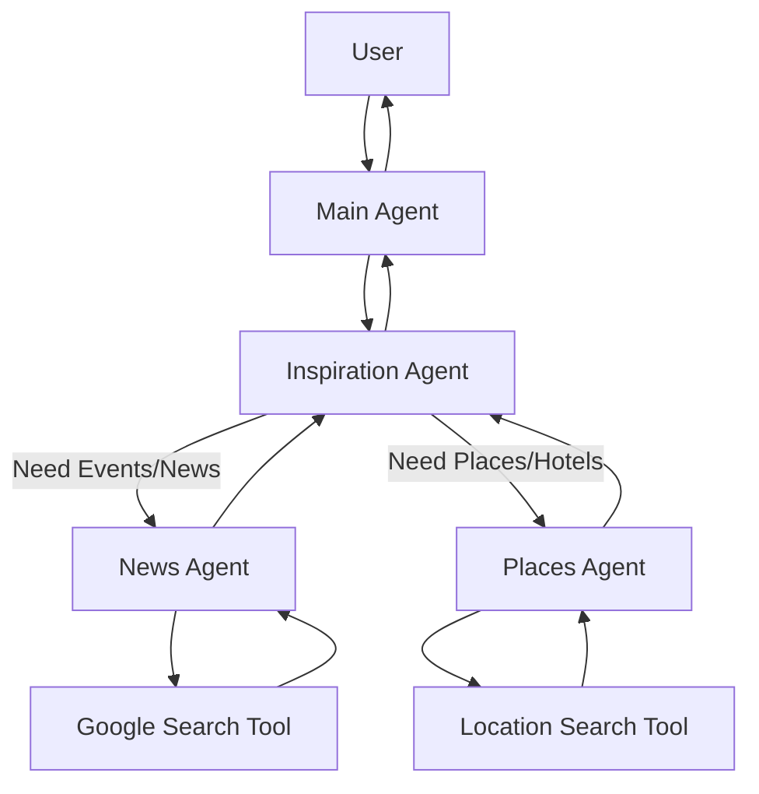

# Travel Planner with ADK

A smart travel concierge agent built with the Agent Development Kit (ADK). This agent helps users plan trips by providing travel inspiration, finding real-time events/news, and locating specific places (hotels, restaurants, etc.) using OpenStreetMap data.

## Features

-   **Travel Inspiration**: Suggests destinations and activities based on user preferences.
-   **Real-time News & Events**: Uses Google Search to find current events, festivals, and travel advisories.
-   **Place Finder**: Locates nearby places (restaurants, hotels, attractions) using `geopy` and the Overpass API (OpenStreetMap). No API keys required for place search!

## Architecture

The system consists of a main orchestrator agent and specialized sub-agents:

1.  **`Travel_planner_main_agent`**: The interface for the user. It delegates tasks to the inspiration agent.
2.  **`Travel_inspiration_agent`**: The core planner. It can consult the news and places agents.
3.  **`news_agent`**: Specializes in finding current information using Google Search.
4.  **`places_agent`**: Specializes in finding physical locations using the custom `find_nearby_places` tool.

## Workflow

The agent follows a hierarchical workflow to handle user requests:

1.  **User Request**: The user sends a query (e.g., "Plan a trip to Paris").
2.  **Main Agent (`Travel_planner_main_agent`)**: Receives the request. It acts as the concierge and delegates the planning to the `Travel_inspiration_agent`.
3.  **Inspiration Agent (`Travel_inspiration_agent`)**: Analyzes the request to identify the destination and user interests.
    *   **If news/events are needed**: It calls the `news_agent`.
    *   **If specific places are needed**: It calls the `places_agent`.
4.  **Tool Execution**:
    *   `news_agent` uses `google_search` to fetch real-time info.
    *   `places_agent` uses `location_search_tool` (Geopy + Overpass) to find coordinates and details.
5.  **Response Synthesis**: The sub-agents return their findings to the Inspiration Agent, which synthesizes a complete travel plan and sends it back to the Main Agent to present to the user.



## Prerequisites

-   Python 3.10+
-   `uv` (recommended for dependency management) or `pip`
-   A Google Gen AI API Key (for Gemini models)

## Installation

1.  **Clone the repository** (if applicable) or navigate to the project directory.

2.  **Install dependencies**:
    ```bash
    uv sync
    # OR
    pip install -r requirements.txt
    ```

3.  **Set up Environment Variables**:
    Create a `.env` file in `travel_planner/` or the root directory and add your API key:
    ```env
    GOOGLE_API_KEY=your_api_key_here
    ```

## Usage

### Running the Agent

You can run the agent using the ADK CLI web interface:

```bash
uv run adk web
```

This will start a local web server where you can chat with the agent.

### Example Prompts

Try these prompts to test the agent's capabilities:

*   **General Planning**: "Plan a 3-day romantic getaway to Paris for me."
*   **Events & News**: "Are there any festivals in Tokyo next month?"
*   **Place Search**: "Find vegetarian restaurants near Central Park, New York."
*   **Combined Request**: "I'm planning a trip to London. What are the major events happening there this month, and can you find me some vegetarian restaurants near the British Museum?"

## Project Structure

-   `travel_planner/`
    -   `agent.py`: Defines the main root agent.
    -   `supporting_agents.py`: Defines the sub-agents (Inspiration, News, Places).
    -   `tools.py`: Contains custom tools, including `find_nearby_places`.
-   `main.py`: Entry point for the application.

## Tools Used

-   **Google Gen AI SDK**: For LLM capabilities.
-   **Google Search Tool**: For grounding responses in real-time data.
-   **Geopy**: For geocoding location names to coordinates.
-   **Overpass API**: For querying OpenStreetMap data to find places.
